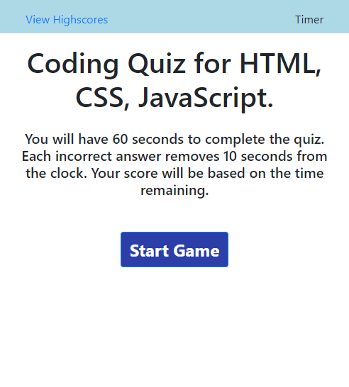

# codingTrivia
Develop a trivia game, with a timer, and scoring. 
This game was a practice in manipulating the DOM with JS. This was a good exercise to learn working with Objects, arrays and putting them on and off the page. 

I created the formatting with bootstrap to create a basic grid layout and used bootstrap button styling. I also used this to make my game stay in the center of the screen. I also added the coloring of the buttons when the answer is correct or incorrect. I have that displaying for the user with a .5 second delay. 

Further development of this quiz would include working through some of the glitches that happen when you click the View High scores. I also would like to figure out how to sort my high scores list correctly.  I also have decided to allow the user to get a negative score with too many incorrect answers. This could be something that could be further refined with more development. I also noticed some strange behavior as I click the high scores link and back to the game. 

Deployed project - https://cloudflying87.github.io/codingTrivia/
GitHub repo - https://github.com/cloudflying87/codingTrivia